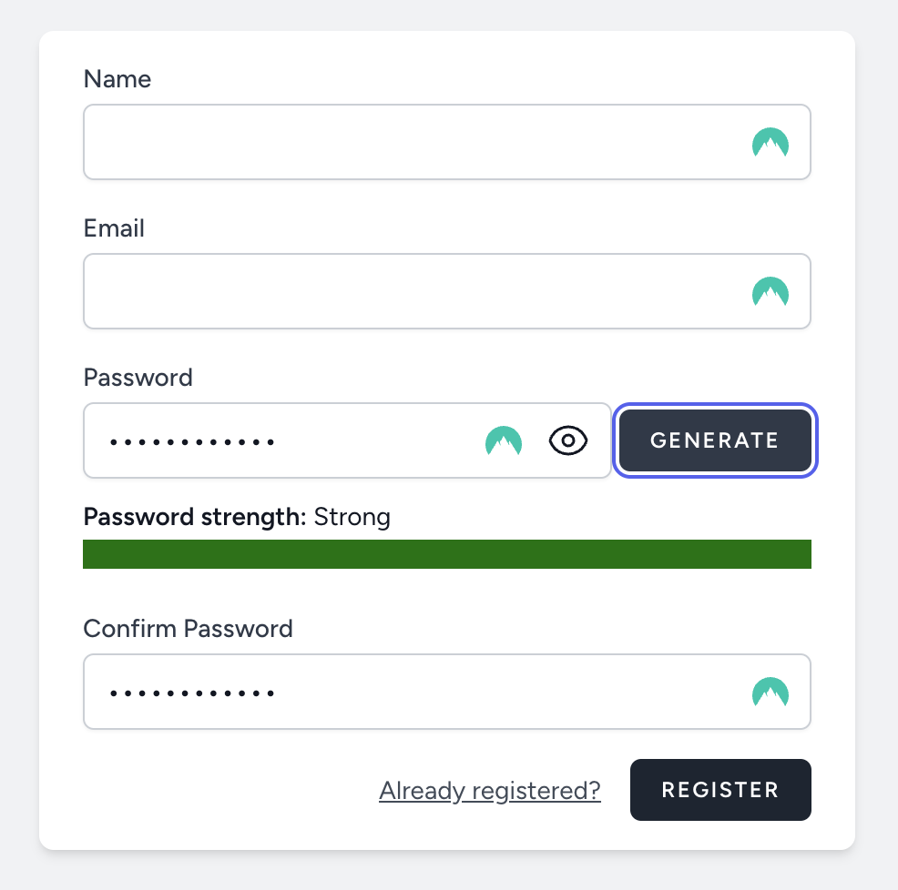
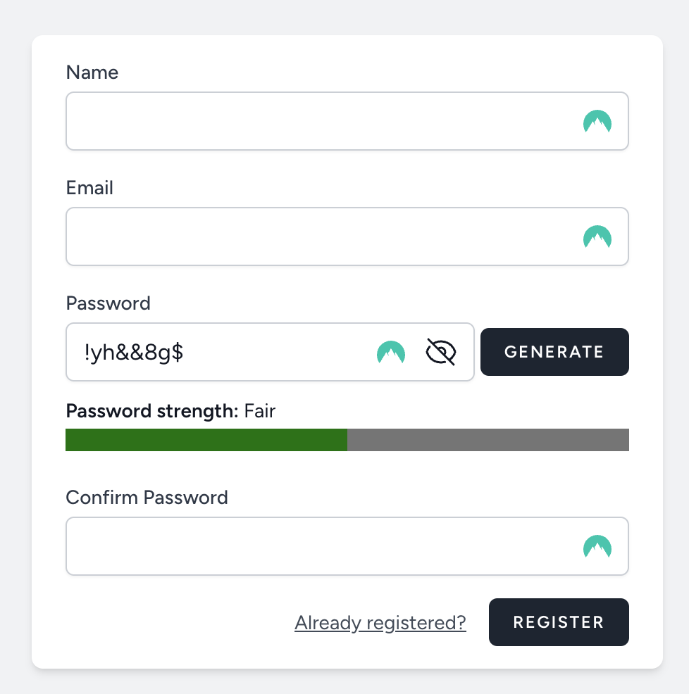
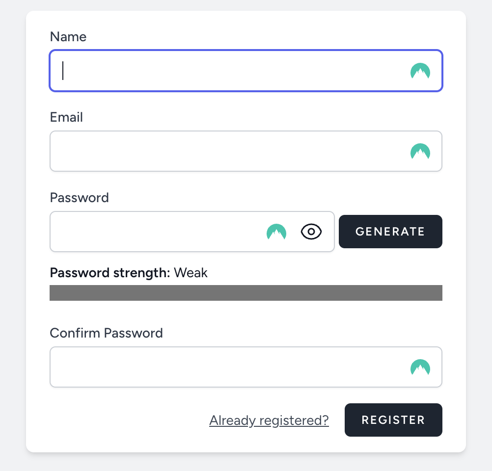
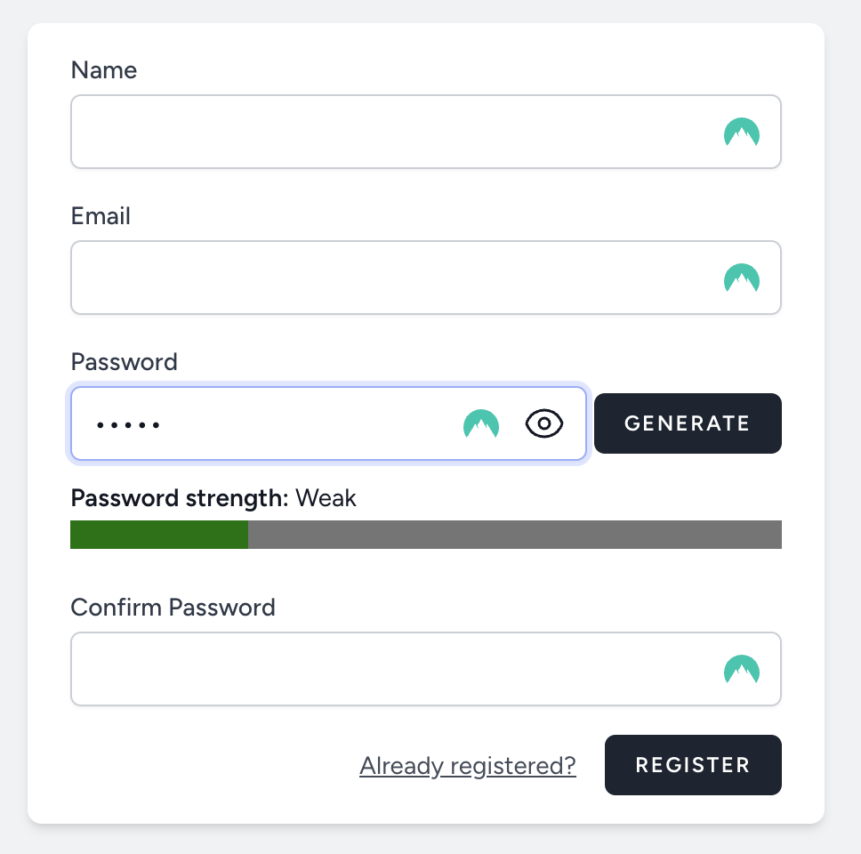

# 🧑‍💼 Laravel Breeze Customisation

Adding a password generator functionality and password strength estimator to laravel breeze starter kit.

---

## 🚀 Features


- ✅ **Authentication** – Login, Register
- ✅ **Reusable Blade Components**
- ✅ **Alpine Js**
- ✅ **Responsive UI** – Built with Tailwind CSS

---

## 🛠 Tech Stack

| Layer         | Tools & Frameworks                   |
|---------------|--------------------------------------|
| **Backend**   | Laravel 12+, PHP 8.3+, Livewire      |
| **Database**  | MySQL                                |  

---

## ⚙️ Installation Guide


```bash
laravel new breeze-customisation
composer require laravel/breeze --dev
php artisan breeze:install
composer require livewire/livewire
composer require bjeavons/zxcvbn-php
```
## Password generator
<p align="center"> </p>

## Password visibility
<p align="center"> </p>

## Password strength estimator
<p align="center"> </p>

## Password strength.
<p align="center"> </p>

